# PBQ captures — 2026-06-22

Security+ **SY0-701** drag-and-drop, PBQ, and simulation references. Expand `config/secplus-pbq-capture-targets.json` and `pbq_poll` sites as you add sources.

Regenerate: `npm run secplus:pbq-capture` · Text scan: `npm run secplus:pbq-monthly`

---

## PBQ / sim UI captured

### bct-pbq-dragdrop-template · drag-drop · Tier a

**Status:** captured-pbq — PBQ / sim UI screenshot — paraphrase for BCT; verify Tier A

**Open:** [http://localhost:3000/COMP_TIA_SEC+/SEC+_PBQ/TEMPLATE-dragdrop.html](http://localhost:3000/COMP_TIA_SEC+/SEC+_PBQ/TEMPLATE-dragdrop.html)

Folder: `captures/2026-06-22/bct-pbq-dragdrop-template/`

---

### bct-pbq-log-timeline · simulation · Tier a

**Status:** captured-pbq — PBQ / sim UI screenshot — paraphrase for BCT; verify Tier A

**Open:** [http://localhost:3000/COMP_TIA_SEC+/SEC+_PBQ/log-timeline-forensics.html](http://localhost:3000/COMP_TIA_SEC+/SEC+_PBQ/log-timeline-forensics.html)

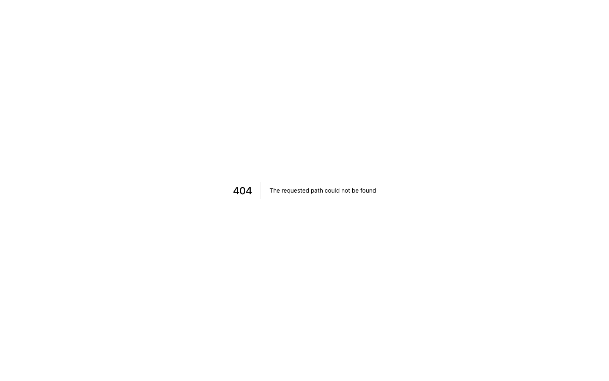

Folder: `captures/2026-06-22/bct-pbq-log-timeline/`

---

### bct-pbq-security-control-map · drag-drop · Tier a

**Status:** captured-pbq — PBQ / sim UI screenshot — paraphrase for BCT; verify Tier A

**Open:** [http://localhost:3000/COMP_TIA_SEC+/SEC+_PBQ/security-control-map.html](http://localhost:3000/COMP_TIA_SEC+/SEC+_PBQ/security-control-map.html)

Folder: `captures/2026-06-22/bct-pbq-security-control-map/`

---

### howtonetwork-pbq · drag-drop · Tier b

**Status:** captured-pbq — PBQ / sim UI screenshot — paraphrase for BCT; verify Tier A

**Open:** [https://www.howtonetwork.com/certifications/security/comptia-security-pbq-practice-test-free-sy0-701-questions/](https://www.howtonetwork.com/certifications/security/comptia-security-pbq-practice-test-free-sy0-701-questions/)

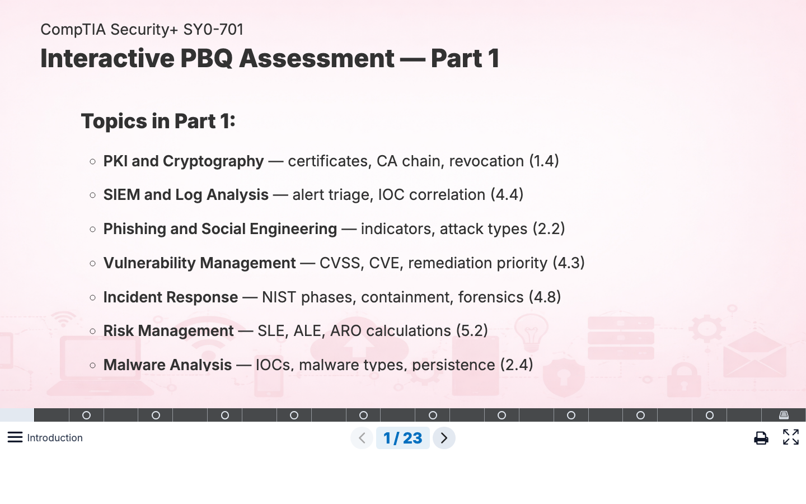

Folder: `captures/2026-06-22/howtonetwork-pbq/`

---

## Login wall / bot check (open in browser — manual screenshot)

### crucialexams-pbq-cloud-waf · simulation · Tier b

**Status:** captured-login-wall — Login / bot wall — open link in browser for read-only PBQ preview; manual screenshot via secplus:pbq-capture register

**Open:** [https://crucialexams.com/study/sy0-701/simulations/configuration/cloud-web-application-firewall-setup](https://crucialexams.com/study/sy0-701/simulations/configuration/cloud-web-application-firewall-setup)

Folder: `captures/2026-06-22/crucialexams-pbq-cloud-waf/`

---

### crucialexams-pbq-cryptographic · drag-drop · Tier b

**Status:** captured-login-wall — Login / bot wall — open link in browser for read-only PBQ preview; manual screenshot via secplus:pbq-capture register

**Open:** [https://crucialexams.com/study/sy0-701/simulations/matching/cryptographic-concepts](https://crucialexams.com/study/sy0-701/simulations/matching/cryptographic-concepts)

Folder: `captures/2026-06-22/crucialexams-pbq-cryptographic/`

---

### crucialexams-pbq-home-wlan · simulation · Tier b

**Status:** captured-login-wall — Login / bot wall — open link in browser for read-only PBQ preview; manual screenshot via secplus:pbq-capture register

**Open:** [https://crucialexams.com/study/sy0-701/simulations/configuration/home-wlan-network-configuration](https://crucialexams.com/study/sy0-701/simulations/configuration/home-wlan-network-configuration)

Folder: `captures/2026-06-22/crucialexams-pbq-home-wlan/`

---

### crucialexams-pbq-incident-response · drag-drop · Tier b

**Status:** captured-login-wall — Login / bot wall — open link in browser for read-only PBQ preview; manual screenshot via secplus:pbq-capture register

**Open:** [https://crucialexams.com/study/sy0-701/simulations/matching/incident-response-procedures](https://crucialexams.com/study/sy0-701/simulations/matching/incident-response-procedures)

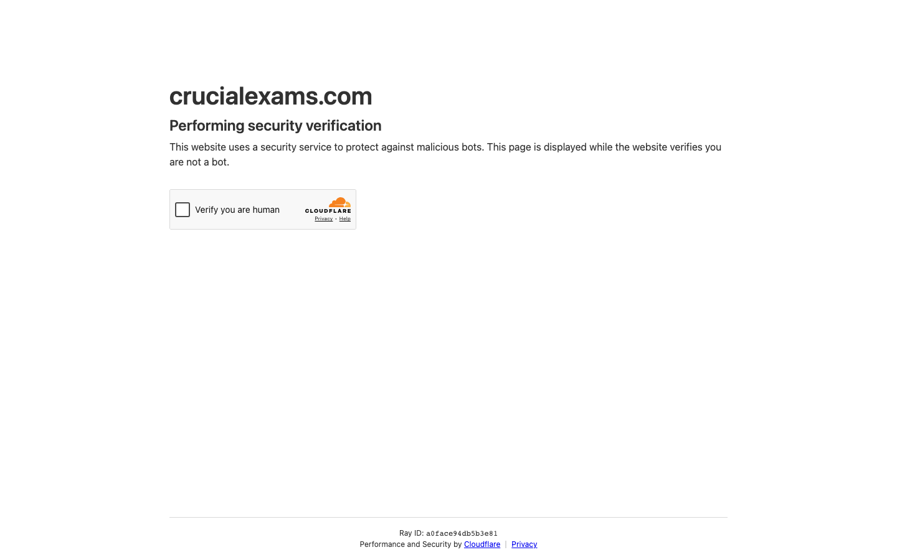

Folder: `captures/2026-06-22/crucialexams-pbq-incident-response/`

---

### crucialexams-pbq-mdm-enrollment · simulation · Tier b

**Status:** captured-login-wall — Login / bot wall — open link in browser for read-only PBQ preview; manual screenshot via secplus:pbq-capture register

**Open:** [https://crucialexams.com/study/sy0-701/simulations/configuration/mobile-device-management-enrollment](https://crucialexams.com/study/sy0-701/simulations/configuration/mobile-device-management-enrollment)

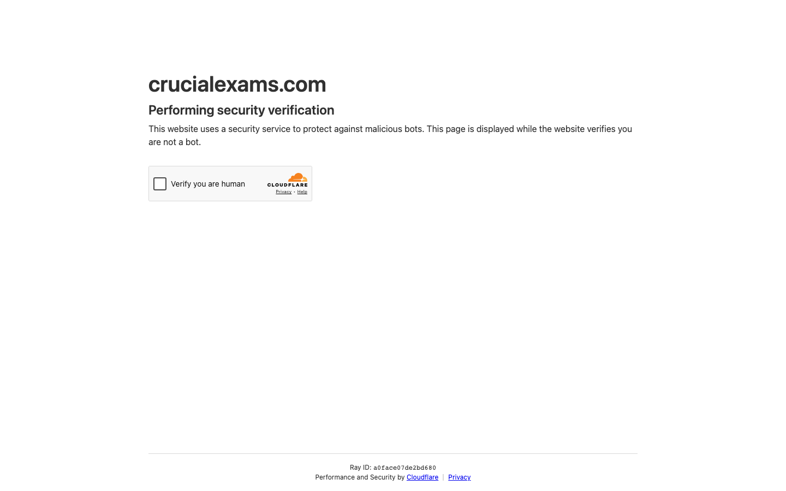

Folder: `captures/2026-06-22/crucialexams-pbq-mdm-enrollment/`

---

### crucialexams-pbq-network-components · drag-drop · Tier b

**Status:** captured-login-wall — Login / bot wall — open link in browser for read-only PBQ preview; manual screenshot via secplus:pbq-capture register

**Open:** [https://crucialexams.com/study/sy0-701/simulations/matching-diagram/network-components-and-common-protocols](https://crucialexams.com/study/sy0-701/simulations/matching-diagram/network-components-and-common-protocols)

Folder: `captures/2026-06-22/crucialexams-pbq-network-components/`

---

### crucialexams-pbq-network-protocols · drag-drop · Tier b

**Status:** captured-login-wall — Login / bot wall — open link in browser for read-only PBQ preview; manual screenshot via secplus:pbq-capture register

**Open:** [https://crucialexams.com/study/sy0-701/simulations/matching/network-security-protocols-and-technologies](https://crucialexams.com/study/sy0-701/simulations/matching/network-security-protocols-and-technologies)

Folder: `captures/2026-06-22/crucialexams-pbq-network-protocols/`

---

### crucialexams-pbq-public-wlan · simulation · Tier b

**Status:** captured-login-wall — Login / bot wall — open link in browser for read-only PBQ preview; manual screenshot via secplus:pbq-capture register

**Open:** [https://crucialexams.com/study/sy0-701/simulations/configuration/public-wlan-network-configuration](https://crucialexams.com/study/sy0-701/simulations/configuration/public-wlan-network-configuration)

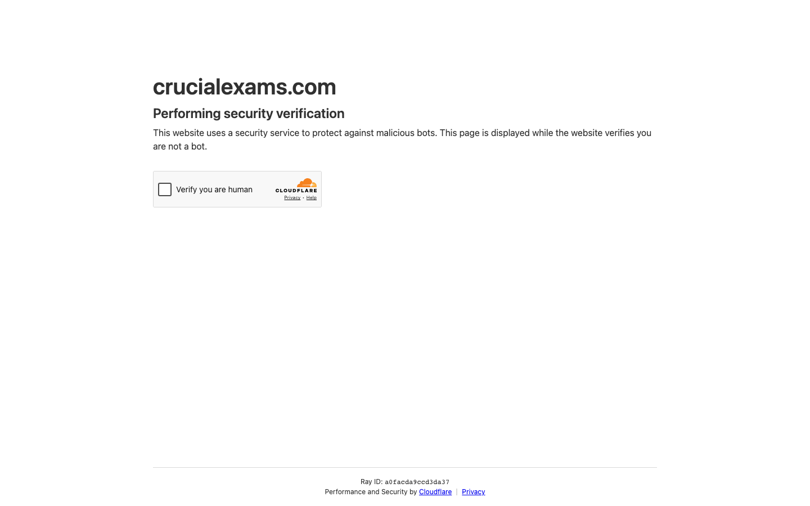

Folder: `captures/2026-06-22/crucialexams-pbq-public-wlan/`

---

### crucialexams-pbq-siem-alert · simulation · Tier b

**Status:** captured-login-wall — Login / bot wall — open link in browser for read-only PBQ preview; manual screenshot via secplus:pbq-capture register

**Open:** [https://crucialexams.com/study/sy0-701/simulations/configuration/siem-alert-configuration](https://crucialexams.com/study/sy0-701/simulations/configuration/siem-alert-configuration)

Folder: `captures/2026-06-22/crucialexams-pbq-siem-alert/`

---

## Landing fallback (open link for preview)

### 9tut-ccna-engine-pbq · pbq · Tier c

**Status:** captured-landing — Marketing/landing page only — not PBQ UI. Open link for preview or manual pbq-preview register.

**Open:** [https://www.9tut.com/ccna-testing-engine](https://www.9tut.com/ccna-testing-engine)

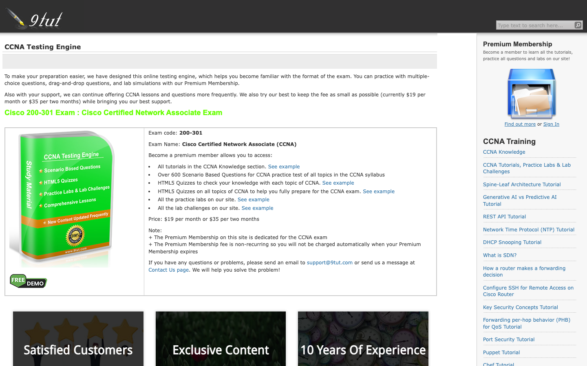

Folder: `captures/2026-06-22/9tut-ccna-engine-pbq/`

---

### actualtests-pbq · pbq · Tier c

**Status:** captured-landing — Marketing/landing page only — not PBQ UI. Open link for preview or manual pbq-preview register.

**Open:** [https://www.actualtests.com/exam-SY0-701.htm](https://www.actualtests.com/exam-SY0-701.htm)

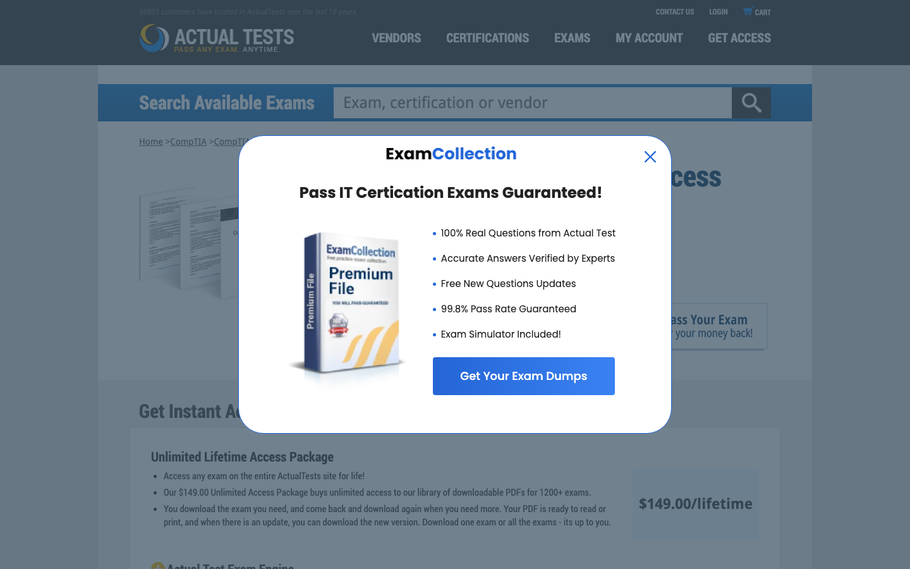

Folder: `captures/2026-06-22/actualtests-pbq/`

---

### certblaster-pbq · pbq · Tier b

**Status:** captured-landing — Marketing/landing page only — not PBQ UI. Open link for preview or manual pbq-preview register.

**Open:** [https://certblaster.com/free-security-sy0-701-practice-test/](https://certblaster.com/free-security-sy0-701-practice-test/)

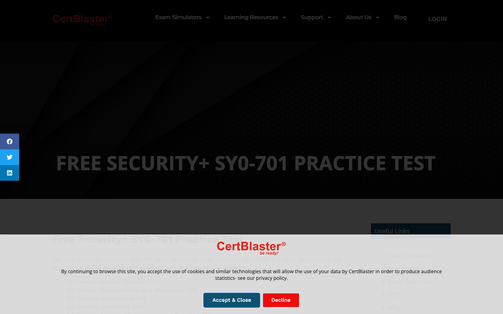

Folder: `captures/2026-06-22/certblaster-pbq/`

---

### certempire-pbq · pbq · Tier c

**Status:** captured-landing — Marketing/landing page only — not PBQ UI. Open link for preview or manual pbq-preview register.

**Open:** [https://certempire.com/exam/sy0-701-exam-questions/](https://certempire.com/exam/sy0-701-exam-questions/)

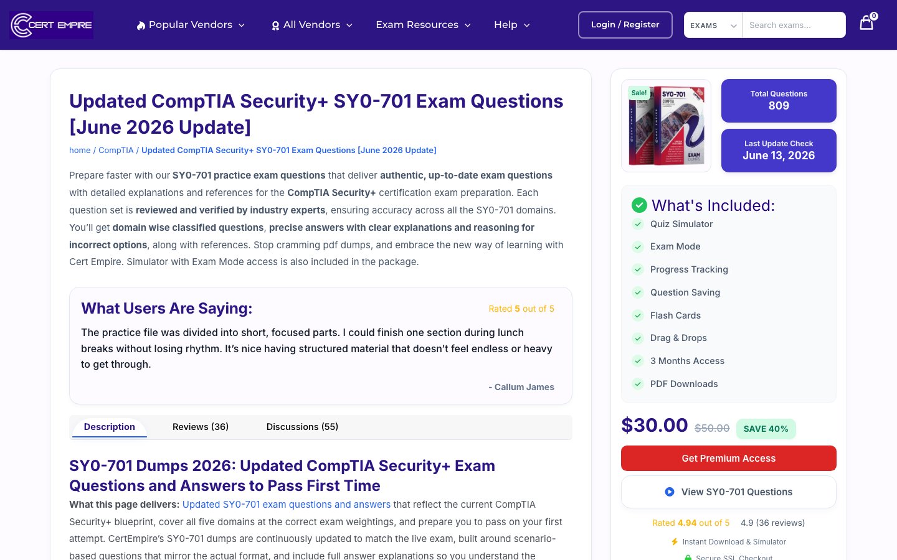

Folder: `captures/2026-06-22/certempire-pbq/`

---

### certimaan-pbq · pbq · Tier b

**Status:** captured-landing — Marketing/landing page only — not PBQ UI. Open link for preview or manual pbq-preview register.

**Open:** [https://www.certimaan.com/post/comptia-security-plus-certification-sample-questions](https://www.certimaan.com/post/comptia-security-plus-certification-sample-questions)

Folder: `captures/2026-06-22/certimaan-pbq/`

---

### crucialexams-ccna-pbq · pbq · Tier b

**Status:** captured-landing — Marketing/landing page only — not PBQ UI. Open link for preview or manual pbq-preview register.

**Open:** [https://crucialexams.com/exams/cisco/ccna/200-301/practice-tests-practice-questions](https://crucialexams.com/exams/cisco/ccna/200-301/practice-tests-practice-questions)

Folder: `captures/2026-06-22/crucialexams-ccna-pbq/`

---

### crucialexams-pbq · drag-drop · Tier b

**Status:** captured-landing — Marketing/landing page only — not PBQ UI. Open link for preview or manual pbq-preview register.

**Open:** [https://crucialexams.com/exams/comptia/security/sy0-701/practice-tests-practice-questions](https://crucialexams.com/exams/comptia/security/sy0-701/practice-tests-practice-questions)

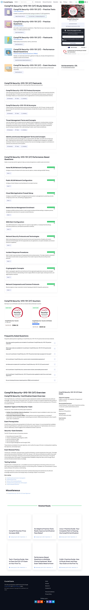

Folder: `captures/2026-06-22/crucialexams-pbq/`

---

### dumpsmate-pbq · pbq · Tier c

**Status:** captured-landing — Marketing/landing page only — not PBQ UI. Open link for preview or manual pbq-preview register.

**Open:** [https://www.dumpsmate.com/SY0-701-exam.html](https://www.dumpsmate.com/SY0-701-exam.html)

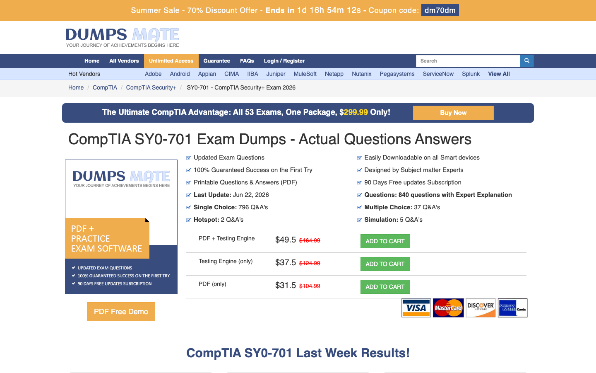

Folder: `captures/2026-06-22/dumpsmate-pbq/`

---

### exam-labs-ccna-pbq · pbq · Tier c

**Status:** captured-landing — Marketing/landing page only — not PBQ UI. Open link for preview or manual pbq-preview register.

**Open:** [https://www.exam-labs.com/dumps/200-301](https://www.exam-labs.com/dumps/200-301)

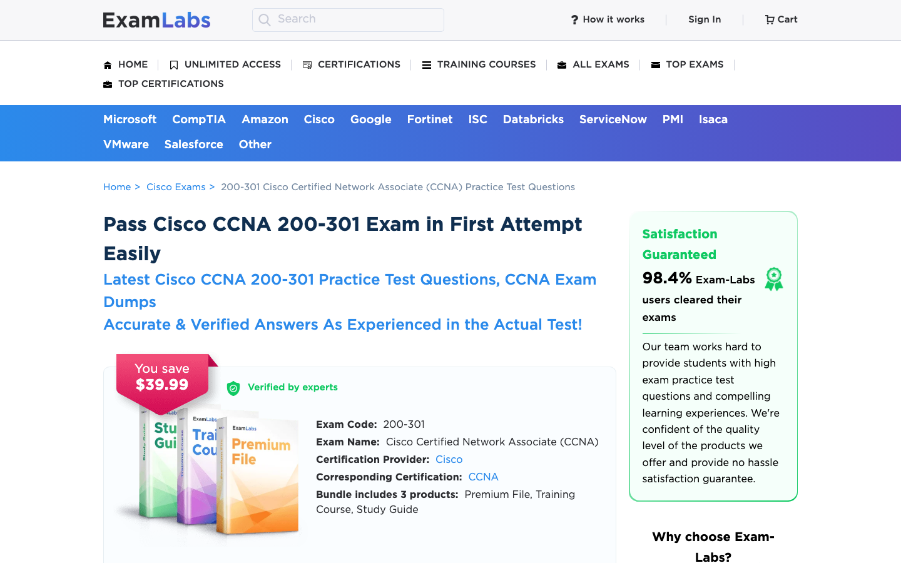

Folder: `captures/2026-06-22/exam-labs-ccna-pbq/`

---

### exam-labs-pbq · pbq · Tier c

**Status:** captured-landing — Marketing/landing page only — not PBQ UI. Open link for preview or manual pbq-preview register.

**Open:** [https://www.exam-labs.com/dumps/SY0-701](https://www.exam-labs.com/dumps/SY0-701)

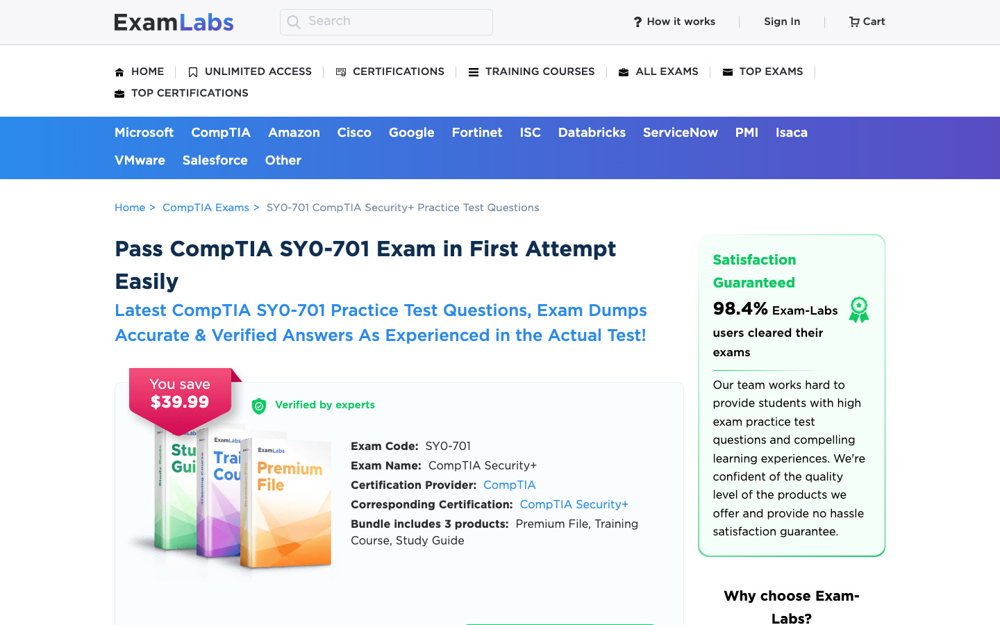

Folder: `captures/2026-06-22/exam-labs-pbq/`

---

### examcollection-ccna-pbq · pbq · Tier c

**Status:** captured-landing — Marketing/landing page only — not PBQ UI. Open link for preview or manual pbq-preview register.

**Open:** [https://www.examcollection.com/200-301-dumps.html](https://www.examcollection.com/200-301-dumps.html)

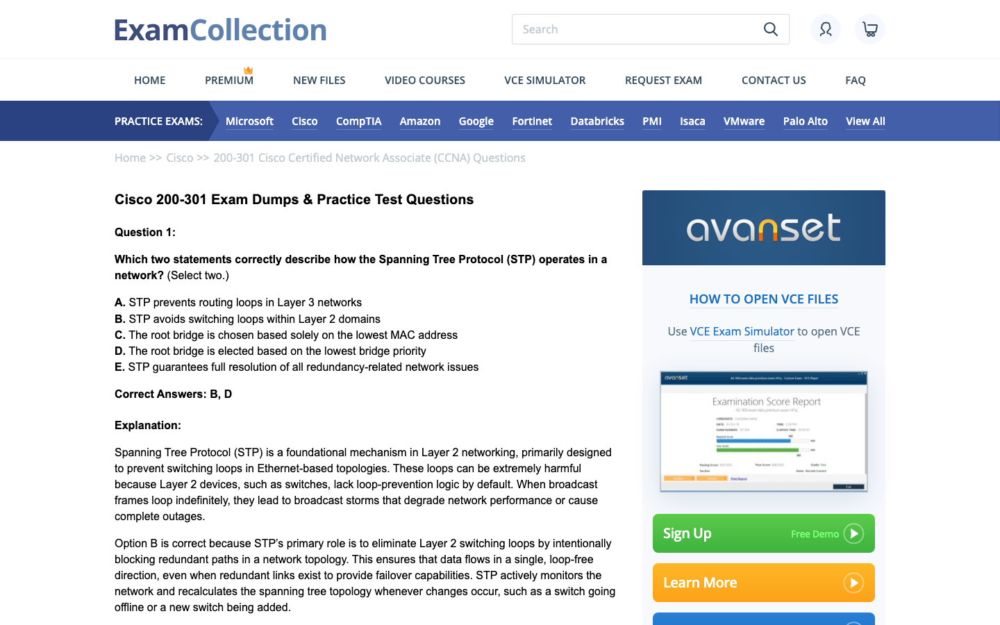

Folder: `captures/2026-06-22/examcollection-ccna-pbq/`

---

### examcollection-pbq · pbq · Tier c

**Status:** captured-landing — Marketing/landing page only — not PBQ UI. Open link for preview or manual pbq-preview register.

**Open:** [https://www.examcollection.com/SY0-701.html](https://www.examcollection.com/SY0-701.html)

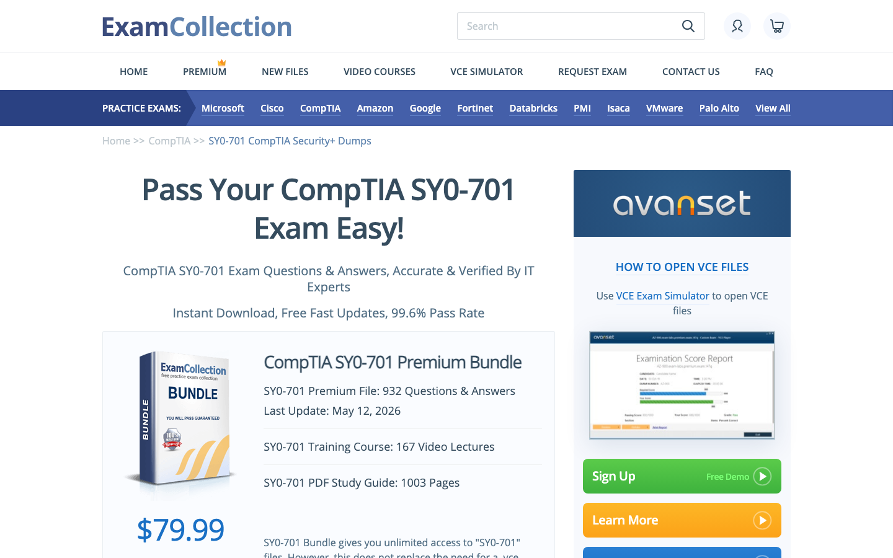

Folder: `captures/2026-06-22/examcollection-pbq/`

---

### examtopics-ccna-pbq · pbq · Tier c

**Status:** captured-landing — Marketing/landing page only — not PBQ UI. Open link for preview or manual pbq-preview register.

**Open:** [https://www.examtopics.com/exams/cisco/200-301/](https://www.examtopics.com/exams/cisco/200-301/)

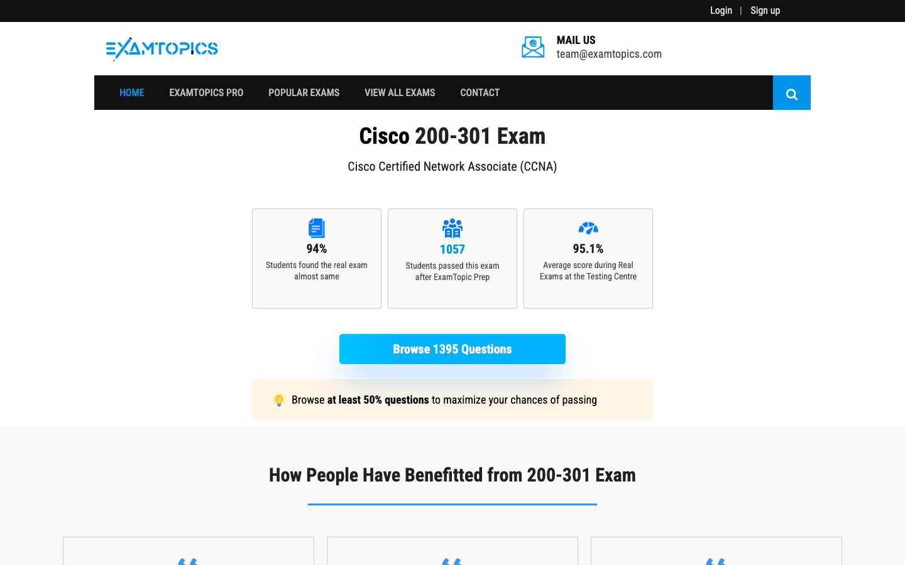

Folder: `captures/2026-06-22/examtopics-ccna-pbq/`

---

### examtopics-pbq · pbq · Tier c

**Status:** captured-landing — Marketing/landing page only — not PBQ UI. Open link for preview or manual pbq-preview register.

**Open:** [https://www.examtopics.com/exams/comptia/sy0-701/](https://www.examtopics.com/exams/comptia/sy0-701/)

Folder: `captures/2026-06-22/examtopics-pbq/`

---

### howtonetwork-ccna-pbq · pbq · Tier b

**Status:** captured-landing — Marketing/landing page only — not PBQ UI. Open link for preview or manual pbq-preview register.

**Open:** [https://www.howtonetwork.com/free/cisco-ccna-exam-walkthrough/](https://www.howtonetwork.com/free/cisco-ccna-exam-walkthrough/)

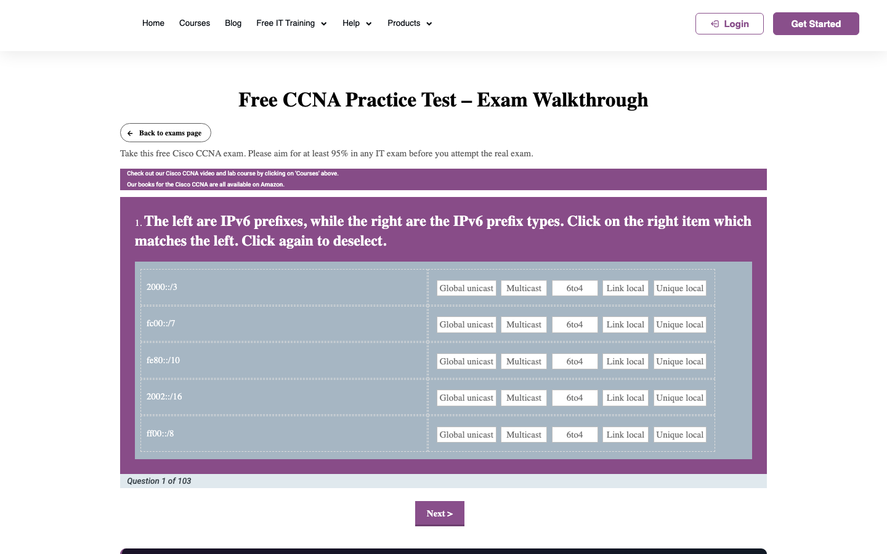

Folder: `captures/2026-06-22/howtonetwork-ccna-pbq/`

---

### mastery-ccna-pbq · pbq · Tier b

**Status:** captured-landing — Marketing/landing page only — not PBQ UI. Open link for preview or manual pbq-preview register.

**Open:** [https://masteryexamprep.com/exams/cisco/ccna/](https://masteryexamprep.com/exams/cisco/ccna/)

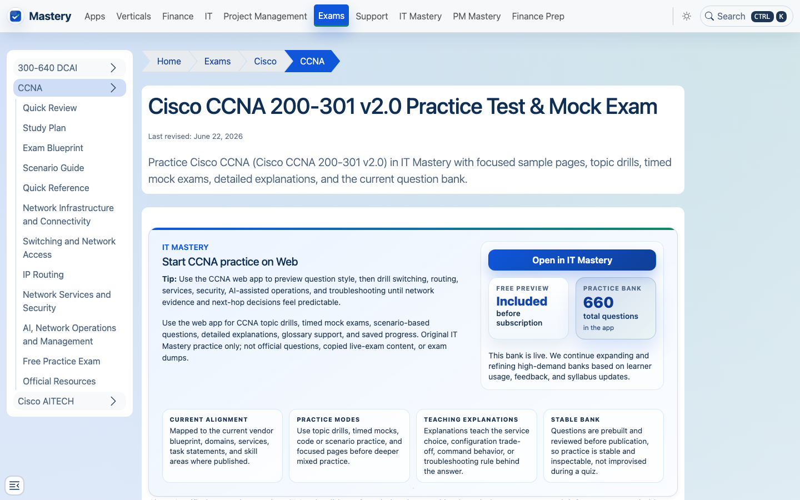

Folder: `captures/2026-06-22/mastery-ccna-pbq/`

---

### mastery-pbq · pbq · Tier b

**Status:** captured-landing — Marketing/landing page only — not PBQ UI. Open link for preview or manual pbq-preview register.

**Open:** [https://masteryexamprep.com/exams/comptia/sy0-701/](https://masteryexamprep.com/exams/comptia/sy0-701/)

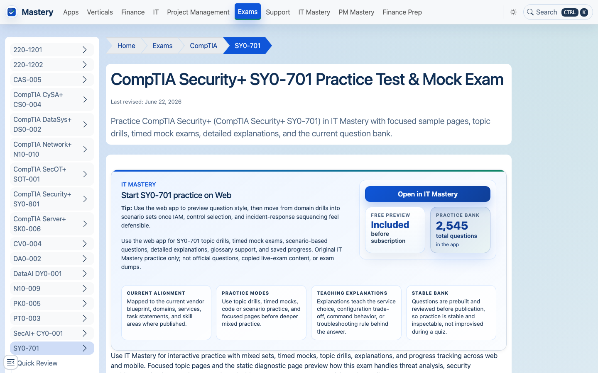

Folder: `captures/2026-06-22/mastery-pbq/`

---

### openexamprep-ccna-pbq · pbq · Tier b

**Status:** captured-landing — Marketing/landing page only — not PBQ UI. Open link for preview or manual pbq-preview register.

**Open:** [https://open-exam-prep.com/practice/ccna](https://open-exam-prep.com/practice/ccna)

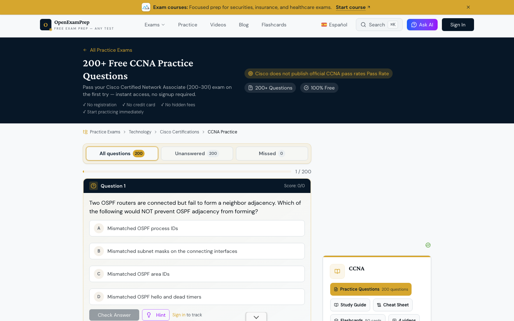

Folder: `captures/2026-06-22/openexamprep-ccna-pbq/`

---

### openexamprep-pbq · pbq · Tier b

**Status:** captured-landing — Marketing/landing page only — not PBQ UI. Open link for preview or manual pbq-preview register.

**Open:** [https://open-exam-prep.com/practice/comptia-security-plus](https://open-exam-prep.com/practice/comptia-security-plus)

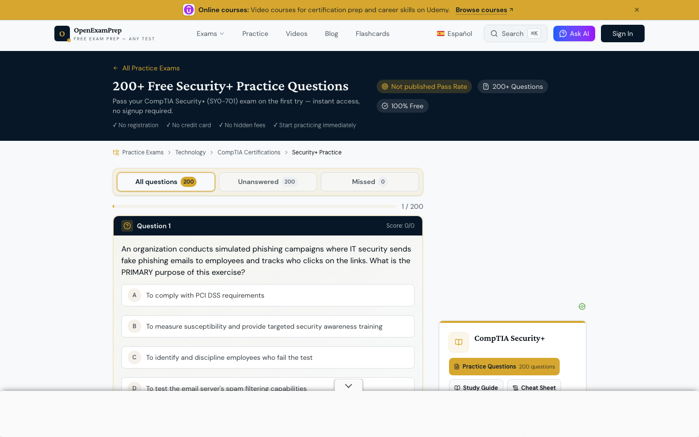

Folder: `captures/2026-06-22/openexamprep-pbq/`

---

### prepaway-ccna-pbq · pbq · Tier c

**Status:** captured-landing — Marketing/landing page only — not PBQ UI. Open link for preview or manual pbq-preview register.

**Open:** [https://www.prepaway.com/ccna-certification-exams.html](https://www.prepaway.com/ccna-certification-exams.html)

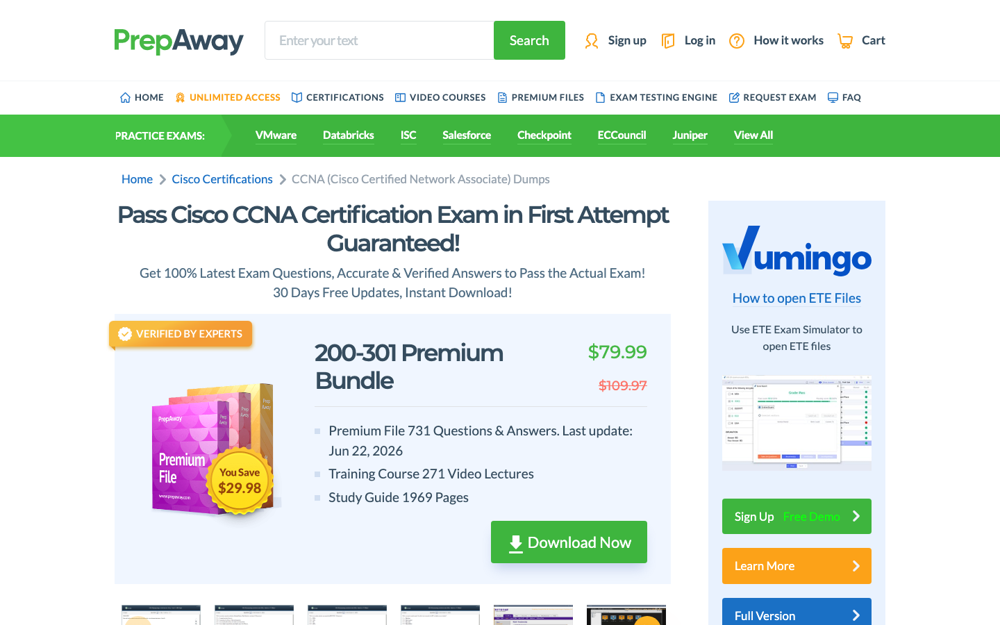

Folder: `captures/2026-06-22/prepaway-ccna-pbq/`

---

### prepaway-pbq · pbq · Tier c

**Status:** captured-landing — Marketing/landing page only — not PBQ UI. Open link for preview or manual pbq-preview register.

**Open:** [https://www.prepaway.com/sy0-701-exam.html](https://www.prepaway.com/sy0-701-exam.html)

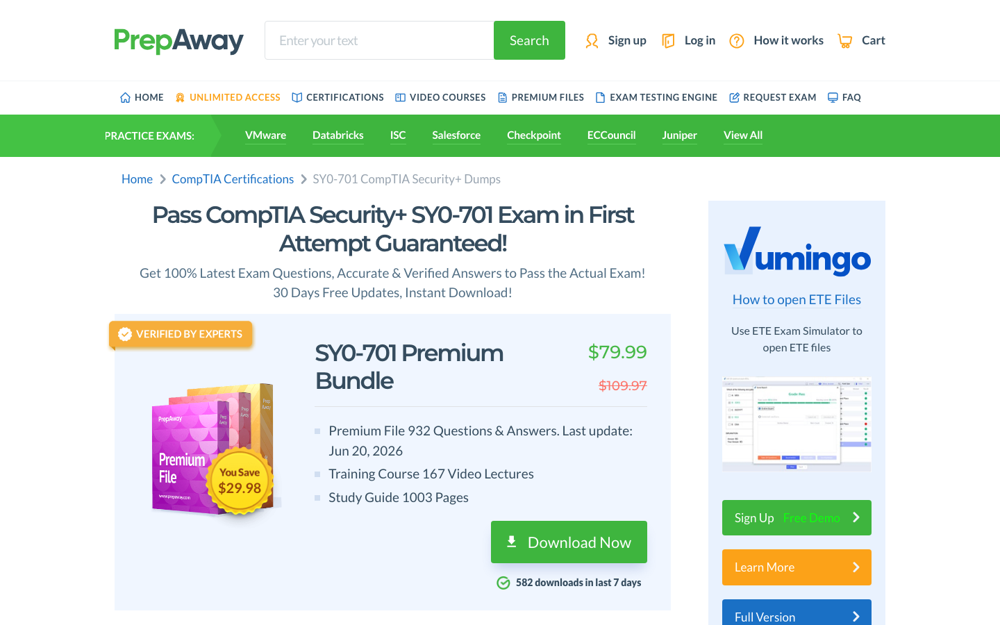

Folder: `captures/2026-06-22/prepaway-pbq/`

---

### preptia-pbq · pbq · Tier b

**Status:** captured-landing — Marketing/landing page only — not PBQ UI. Open link for preview or manual pbq-preview register.

**Open:** [https://www.preptia.com/SY0-701-Comptia-Practice-Test](https://www.preptia.com/SY0-701-Comptia-Practice-Test)

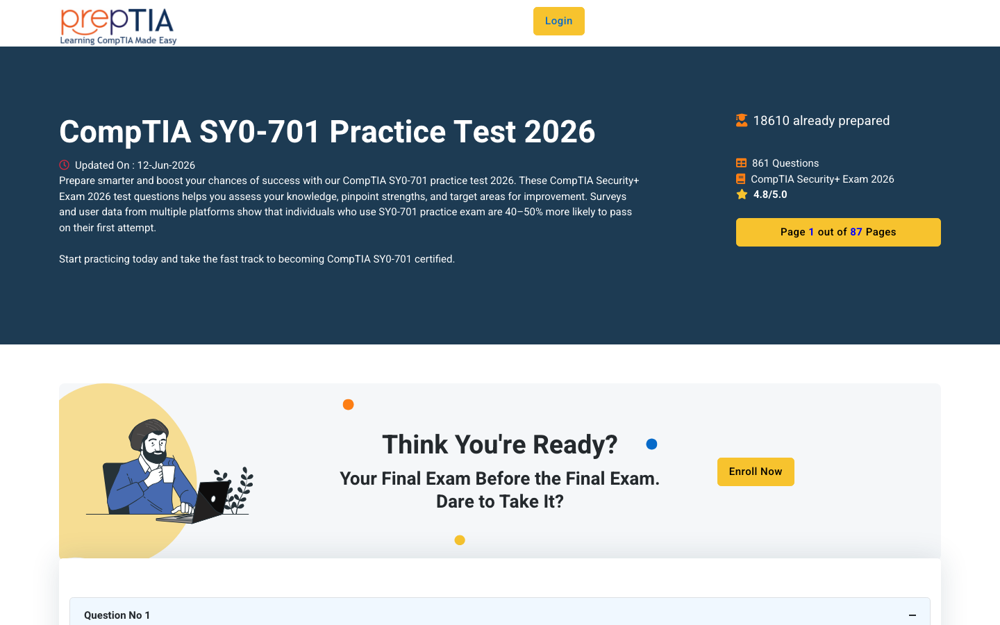

Folder: `captures/2026-06-22/preptia-pbq/`

---

### techexamlexicon-pbq · pbq · Tier b

**Status:** captured-landing — Marketing/landing page only — not PBQ UI. Open link for preview or manual pbq-preview register.

**Open:** [https://techexamlexicon.com/comptia/sy0-701/sample-questions/](https://techexamlexicon.com/comptia/sy0-701/sample-questions/)

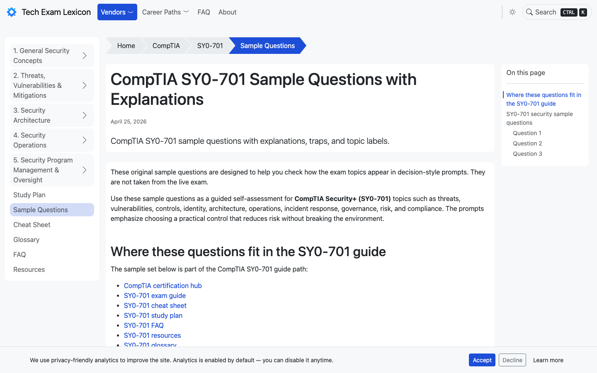

Folder: `captures/2026-06-22/techexamlexicon-pbq/`

---

## Link only (manual screenshot or recall)

### reddit-comptia-pbq · pbq · Tier c

**Status:** link-only — Link-only — open in browser for PBQ recall or preview

**Open:** [https://www.reddit.com/r/CompTIA/search/?q=SY0-701+PBQ&restrict_sr=1](https://www.reddit.com/r/CompTIA/search/?q=SY0-701+PBQ&restrict_sr=1)

Folder: `captures/2026-06-22/reddit-comptia-pbq/`

---

### reddit-securityplus-pbq · pbq · Tier c

**Status:** link-only — Link-only — open in browser for PBQ recall or preview

**Open:** [https://www.reddit.com/r/SecurityPlus/search/?q=SY0-701+PBQ&restrict_sr=1](https://www.reddit.com/r/SecurityPlus/search/?q=SY0-701+PBQ&restrict_sr=1)

Folder: `captures/2026-06-22/reddit-securityplus-pbq/`

---
