# Pricing & funnel

[[Wedge Marketing plan|← Back to plan]]

---

## Pricing philosophy

**Do not** race course vendors to the bottom on price.

**Do** sell a **time-boxed exam sprint** with progress tracking included — not a separate membership.

Aligns with [[../Site Mission|Site Mission]]: one payment, clear access period, no subscription games.

---

## Current offers (keep)

| Product | Price | Audience |
|---------|-------|----------|
| CCNA 10-day portal | **$9.99** | 2–3 weeks out (primary wedge offer) |
| CCNA 30-day portal | **$19.99** | 4–6 weeks out |
| ENCOR 30-day portal | **$19.99** | Primary ENCOR purchase |
| ENCOR 10-day popup | **$9.99** | One-time on-page only |

---

## Optional additions (test later)

| Offer | Price idea | Notes |
|-------|------------|-------|
| Exam week pass (7 days) | $14.99 | Between 10d and 30d; “exam in 7 days” messaging |
| Readiness bundle | Same as 10-day | Package: timed sim + weak-domain review path (story, not new SKU) |

**Avoid** monthly membership unless data shows repeat buyers (retakes). Your audience is **one cert, one sprint**.

---

## Progress tracking

- **Include in every paid pass** — not a paid tier
- Message: *Review modes loop missed answers; see where to spend your last 2 weeks*
- This is your answer to “big banks with no adaptive learning”

---

## PayPal

| | Recommendation |
|---|----------------|
| **Add?** | Yes, as **second checkout option** alongside Stripe |
| **Why** | US trust, “small purchase” friction |
| **Not a strategy** | Won’t fix high CPC; helps conversion after click |
| **Priority** | After wedge landing pages + US geo fix |

---

## Funnel — 2–3 weeks from exam

```mermaid
flowchart TD
  A[Wedge ad or organic page] --> B{Free sample?}
  B -->|Lab intent| C[VLAN CLI lab sample]
  B -->|Readiness| D[Free assessment + scorecard]
  B -->|Timed sim story| E[Timed sim landing page]
  C --> F[10-day pass $9.99]
  D --> F
  E --> F
  F --> G[Timed sim in portal]
  G --> H[Weak-domain review loop]
  H --> I[Exam day]
```

---

## Messaging by stage

| Stage | Message |
|-------|---------|
| Ad | Browser labs · no GNS3 · timed sim · $9.99 / 10 days |
| Sample | Same UI as full access — judge quality free |
| Checkout | One-time · no auto-renew · progress tracking included |
| Portal | Quiet study — no ads in library |

---

## India / low-conversion geo

- **Paid:** exclude until US `begin_checkout` CPA is known
- **Free samples:** still available globally (organic)
- **Fraud pattern:** high clicks, no checkout, sample-only — filter with geo + negatives (`free` on purchase campaigns)

---

## GA4 events to watch

| Event | Meaning |
|-------|---------|
| `begin_checkout` | Primary Ads conversion |
| `ccna_free_assessment_click` | Top-of-funnel quality |
| `purchase` | Revenue |

Segment by `country`, `utm_content`, `utm_campaign`.
