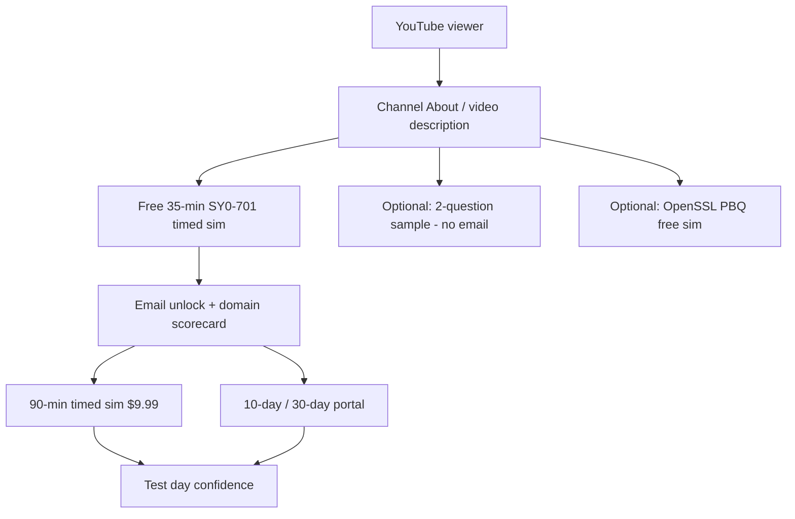

# YouTube channel setup — copy & funnel guide

**@handle:** [youtube.com/@BeCertifiedToday](https://www.youtube.com/@BeCertifiedToday)  
**Channel ID:** [youtube.com/channel/UCOD6uQlfTMgmLWbVgItqYQg](https://www.youtube.com/channel/UCOD6uQlfTMgmLWbVgItqYQg)

Paste from this note into **YouTube Studio → Customization → Basic info** (and **Channel links**). Strategy: [[README|09-youtube hub]] · UTMs: [[site-integration-and-utm|site integration]] · Positioning: [[../01-strategy/positioning-and-messaging|positioning]]

---

## Funnel map (guide new testers)

Use this order in the **channel description**, **pinned comments**, and **video descriptions**. One primary CTA per touchpoint.



| Step | Who | Destination | Conversion |
|------|-----|-------------|------------|
| **1 — Start** | Every new Security+ tester | [Free timed sim](https://becertifiedtoday.com/comptia-sec+-home.html#secplus-lead-capture?utm_source=youtube&utm_medium=organic&utm_campaign=channel_about) | `generate_lead` |
| **2 — Try without email** | Curious / Shorts viewers | [Sample questions](https://becertifiedtoday.com/secplus-sample?track=questions&utm_source=youtube&utm_medium=organic&utm_campaign=channel_about&utm_content=sample-questions) | Engagement |
| **3 — PBQ focus** | Performance-based search | [OpenSSL PBQ sim](https://becertifiedtoday.com/COMP_TIA_SEC+/SEC+_Sim_Hot_Spot/simulation-secure-web-architecture-openssl.html?utm_source=youtube&utm_medium=organic&utm_campaign=channel_about&utm_content=openssl-pbq) | Practice → home upsell |
| **4 — Full dry run** | Ready after free sim | [Purchase — timed sim / portal](https://becertifiedtoday.com/comptia-sec+-home.html#purchase?utm_source=youtube&utm_medium=organic&utm_campaign=channel_about&utm_content=purchase) | `begin_checkout` |

**Rule:** Videos 1–8 point to **Step 1** only. Mention Steps 3–4 in description lines 2–3, not in the hook.

**Later (CCNA / ENCOR):** swap primary link to `#ccna-lead-capture` or `#encor-lead-capture` with `utm_campaign=ccna_yt` / `encor_yt` — see [[site-integration-and-utm#CCNA / ENCOR (phase 2+)|UTM doc]].

---

## Channel description (paste into About)

**Limit:** 1,000 characters. Version below is ~980 characters — edit in Studio if YouTube rejects.

```
Be Certified Today is exam preparation for people who already study for a certification and want realistic practice before test day—not a video course and not PDF dumps.

START HERE — CompTIA Security+ SY0-701 (free timed sample):
https://becertifiedtoday.com/comptia-sec+-home.html#secplus-lead-capture?utm_source=youtube&utm_medium=organic&utm_campaign=channel_about

On the site you can:
• Run a FREE 35-minute timed sample (multiple-choice + performance-based practice) and get a domain scorecard
• Take a full 90-minute SY0-701 exam simulation in the browser ($9.99, one attempt)
• Get 10-day or 30-day portal access with question banks, PBQs, and review modes
• Practice on desktop, tablet, or phone—no app install

On this channel you will see:
• Short explanations of SY0-701-style questions and PBQ simulations
• Screen tours of timed exams, mark-for-review, and how online practice works
• Tips for studying on mobile and using scorecards to focus weak domains

For government and contractor schedules: browser prep fits shift work and travel—confirm your role’s certification requirements with your security office (we provide exam prep only).

Cisco CCNA and CCNP ENCOR practice demos coming to this channel after Security+.

Exam prep only. Not affiliated with or endorsed by CompTIA or Cisco.
https://becertifiedtoday.com
```

### Short tagline (optional — banner / first line of bio elsewhere)

Use if a platform asks for a one-liner (&lt;150 chars):

```
SY0-701 exam prep in your browser—free timed sample, realistic simulations, verified explanations. Not a course. becertifiedtoday.com
```

---

## Channel name & handle

| Field | Value |
|-------|--------|
| **Name** | Be Certified Today |
| **Handle** | @BeCertifiedToday |
| **Public URL** | https://www.youtube.com/@BeCertifiedToday |
| **Channel ID URL** | https://www.youtube.com/channel/UCOD6uQlfTMgmLWbVgItqYQg |
| **Channel ID** | `UCOD6uQlfTMgmLWbVgItqYQg` |

---

## Channel links (Customization → Profile → Links)

Add up to five. Order matters—**link 1 = primary funnel.**

| Link title (label)                | URL                                                                                                                                                             |
| --------------------------------- | --------------------------------------------------------------------------------------------------------------------------------------------------------------- |
| **Free Security+ SY0-701 sample** | `https://becertifiedtoday.com/comptia-sec+-home.html#secplus-lead-capture?utm_source=youtube&utm_medium=organic&utm_campaign=channel_link&utm_content=free-sim` |
| **Security+ practice home**       | `https://becertifiedtoday.com/comptia-sec+-home.html?utm_source=youtube&utm_medium=organic&utm_campaign=channel_link&utm_content=home`                          |
| **Pricing & timed sim**           | `https://becertifiedtoday.com/comptia-sec+-home.html#purchase?utm_source=youtube&utm_medium=organic&utm_campaign=channel_link&utm_content=purchase`             |
| **Free sample questions**         | `https://becertifiedtoday.com/secplus-sample?track=questions&utm_source=youtube&utm_medium=organic&utm_campaign=channel_link&utm_content=sample`                |
| **Website**                       | `https://becertifiedtoday.com?utm_source=youtube&utm_medium=organic&utm_campaign=channel_link&utm_content=root`                                                 |

---

## Channel keywords (Studio → Settings → Channel → Advanced settings)

**Where:** YouTube Studio → **Settings** (gear) → **Channel** → **Advanced settings** → **Keywords**

**Limit:** 500 characters total for the whole field. Paste the **one line** below (≈470 characters).

### Paste this (one line)

```
CompTIA Security+, SY0-701, Security+ practice test, Security+ exam prep, SY0-701 practice exam, Security+ mock exam, Security+ simulation, Security+ PBQ, SY0-701 practice questions, Security+ timed practice, exam preparation, practice exam, timed exam simulation, certification exam prep, browser exam prep, performance based questions, comptia security plus, cybersecurity certification, exam simulation online, comptia exam practice, Be Certified Today
```

### Keyword list (reference)

| Keyword / phrase | Why |
|------------------|-----|
| CompTIA Security+, SY0-701 | Exam identity |
| Security+ practice test, practice exam | Core search intent |
| Security+ exam prep, comptia exam practice | Prep (not course) |
| Security+ simulation, exam simulation online | Product differentiator |
| Security+ mock exam, timed practice | Timed sim intent |
| Security+ PBQ, performance based questions | PBQ viewers |
| SY0-701 practice exam, practice questions | Code-specific |
| browser exam prep | No PDF / no install |
| exam preparation, certification exam prep | Category |
| cybersecurity certification | Broader discovery |
| Be Certified Today | Brand |

### Do not add as channel keywords

`Security+ course`, `free course`, `brain dump`, `exam dump`, `guaranteed pass`, `Professor Messer` (comparison videos OK; don’t optimize channel for course intent)

---

## Banner & branding notes

| Element | Copy suggestion |
|---------|-----------------|
| **Banner text** | SY0-701 exam prep in your browser · Free timed sample below |
| **Watermark** | Logo only (subtle) |
| **Thumbnail template** | Large “SY0-701” + topic + word **Practice** (not “Course”) |

---

## Default upload defaults (set once)

| Setting | Value |
|---------|--------|
| Category | **Education** |
| Audience | Not made for kids |
| Comments | Hold potentially inappropriate (optional) |
| Playlist default | **SY0-701 — Free practice & simulations** (create empty playlist first) |
| Description boilerplate | See [[site-integration-and-utm#Compliance copy (description footer)|compliance footer]] — append to every upload |

### Upload description boilerplate (append to each video)

```
—
Free SY0-701 timed sample: https://becertifiedtoday.com/comptia-sec+-home.html#secplus-lead-capture?utm_source=youtube&utm_medium=video&utm_campaign=secplus_yt&utm_content=REPLACE_ME
Exam prep only. Not affiliated with or endorsed by CompTIA. Verify requirements with your employer and CompTIA.
```

Replace `REPLACE_ME` per video (e.g. `a1-flagship`).

---

## Setup checklist (mark in Studio)

- [ ] **Basic info → Description** — pasted from above
- [ ] **Basic info → Channel URL** — becertifiedtoday.com (or primary free-sim link if only one custom link allowed on your account tier)
- [ ] **Links** — five links table above
- [ ] **Advanced → Keywords** — pasted
- [ ] **Playlists** — created per [[secplus/launch-plan#Playlists (create before upload 1)|Sec+ launch plan]]
- [ ] **Banner** uploaded
- [ ] **Trailer** — optional; use A1 commercial when recorded
- [ ] Verify mobile: open free-sim link from phone logged out

---

## What not to put in the channel description

| Avoid | Use instead |
|-------|-------------|
| “Full Security+ course free” | “Free timed sample” + paid sim/portal |
| “Guaranteed pass” | “Build confidence before test day” |
| “Actual exam questions” / dumps | “Exam-style practice aligned to objectives” |
| “DoD 8140 approved” | “Confirm requirements with your security office” |
| Coupon codes | [[../01-strategy/promotions-and-coupons|Hold coupons at launch]] |

---

## Decisions log

| Date | Note |
|------|------|
| 2026-06-01 | Channel description + funnel map; primary CTA = free 35-min SY0-701 sim |
