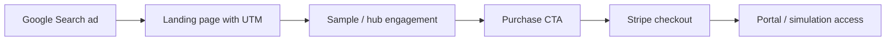

# Marketing plan — Be Certified Today

**Horizon:** 90 days (revise monthly)  
**Channel priority:** Google Ads Search → organic/SEO → retargeting (later)  
**North-star metric:** Paid purchases (portal / timed simulation) with acceptable CPA

---

## 1. Goals

| Phase | Timeline | Goal |
|-------|----------|------|
| Foundation | Weeks 1–2 | GA4 ↔ Ads linked, conversions firing, 2 live Search campaigns |
| Learning | Weeks 3–6 | Stable CTR on brand + exam-intent; search term hygiene; first CPA baseline |
| Scale | Weeks 7–12 | Increase budget on winners; expand CCNP or lab-intent only if CCNA CPA holds |

**Targets (set your numbers):**

- Monthly ad budget: $________
- Target CPA (purchase): $________
- Minimum ROAS (if tracking revenue in Ads): ________

---

## 2. Positioning (summary)

See [[Positioning-and-ICP]].

**One-liner:** Browser-based Cisco CCNA/CCNP practice—questions, labs, drag-and-drop, and timed exam simulation—without PDF dumps.

**Proof points to use in ads:**

- Timed CCNA exam simulation in the browser
- Large CCNA question bank + CLI labs
- Official-style explanations (Cisco-aligned study approach)
- No resale of customer data (privacy FAQ on site)

**Avoid in ads:** “actual exam questions,” “dump,” guaranteed pass language (policy + trust risk).

---

## 3. Funnel

| Stage | On-site assets | Ads message angle |
|-------|----------------|-------------------|
| Awareness | `/index.html`, samples | Certification path, “what’s on the exam” |
| Consideration | `/ccna-home.html`, practice hub links | Practice test, labs, simulation |
| Conversion | Purchase section on home pages | Price, includes, start today |

---

## 4. Google Ads structure (recommended)

### Campaign A — `ccna-search-brand`

- **Type:** Search  
- **Goal:** Capture branded + site-name queries  
- **Geo:** Your primary markets (start US/CA/UK/AU or tighter)  
- **Bidding:** Maximize conversions (after 15–30 conv.) or Maximize clicks with CPC cap initially  
- **Landing:** `https://becertifiedtoday.com/ccna-home.html` + UTMs  
- **Keywords (examples):** `be certified today`, `becertifiedtoday`, `[your brand] ccna`

### Campaign B — `ccna-search-exam-intent`

- **Type:** Search  
- **Goal:** High-intent CCNA 200-301 prep  
- **Landing:** `/ccna-home.html` (anchor to simulation or purchase if you add `#purchase`)  
- **Keywords:** See [[../03-Keywords/Keyword-Research-CCNA]]  
- **Negatives:** free pdf, jobs, salary, course near me (unless you sell local), braindump, actual exam questions

### Campaign C — `ccnp-search-exam-intent` (phase 2)

- **Landing:** `/ccnp-home.html`  
- **Start only after** Campaign B has conversion data or separate budget.

**Not in first 30 days:** Performance Max, Display, YouTube (need creative + conversion history).

---

## 5. Budget & pacing

| Campaign | % of budget (start) | Notes |
|----------|---------------------|-------|
| Brand | 15–25% | Cheap insurance; high QS |
| CCNA exam intent | 60–75% | Core growth |
| CCNP | 0–15% | Phase 2 |

Review **search terms** every 48–72 hours in week 1, then weekly.

---

## 6. Creative guidelines

**RSA headlines (mix & match):**

- CCNA 200-301 Practice Test Online
- Timed CCNA Exam Simulation
- CCNA Labs & Practice Questions
- Browser-Based CCNA Study
- Be Certified Today — CCNA Prep

**Descriptions:**

- Practice questions, CLI labs, and a timed CCNA simulation in your browser.
- Study for the Cisco CCNA exam with structured practice—not PDF dumps.

**Extensions:** Sitelinks to samples, training portal preview (if public), FAQ; callouts: “Timed simulation,” “CLI labs,” “No PDFs.”

---

## 7. Measurement

| Tool | Role |
|------|------|
| GA4 (`G-YTT6KBHX7V`) | Sessions, engagement, events |
| Google Ads | Cost, clicks, conversions (imported from GA4) |
| Stripe | Revenue truth |
| Obsidian vault | Campaign notes, hypotheses, weekly log |

Implementation checklist: [[../05-Analytics/GA4-Google-Ads-Integration]]  
UTM rules: [[../05-Analytics/UTM-Conventions]]

**Key events to mark as conversions in GA4:**

1. `begin_checkout` (purchase button click — site fires via attribution script)  
2. `purchase` or `portal_signup` (when thank-you / portal entry is measurable)  
3. Optional micro-conversions: `view_sample`, `start_practice` (for optimization learning)

---

## 8. 90-day roadmap

### Weeks 1–2 — Foundation

- [ ] Google Ads account + billing  
- [ ] GA4 linked to Ads; auto-tagging ON  
- [ ] Conversion actions imported  
- [ ] Campaign A + B live with UTMs  
- [ ] Attribution script on landing pages  
- [ ] First [[../06-Content-Calendar/Weekly-Review-Template|weekly review]]

### Weeks 3–6 — Optimize

- [ ] Negative keyword list v2  
- [ ] A/B test 2 RSA angles (simulation-led vs. labs-led)  
- [ ] Tune bids / switch to tCPA if volume allows  
- [ ] Landing page: tighten hero + single primary CTA above fold

### Weeks 7–12 — Scale or pivot

- [ ] +20% budget on ad groups with CPA below target  
- [ ] Launch CCNP campaign OR exam-simulation-only ad group  
- [ ] Consider remarketing (GA4 audience → Ads) if traffic ≥ 1k/month

---

## 9. Risks & mitigations

| Risk | Mitigation |
|------|------------|
| High CPC on “CCNA” head terms | Long-tail + simulation/lab modifiers; strong negatives |
| Low conversion rate | Align ad copy with landing H1; reduce menu noise on paid landings |
| Attribution gaps (Stripe link) | `begin_checkout` event + manual weekly Stripe vs. Ads conv. compare |
| Policy disapprovals | No dump/guarantee language; link to real product pages |

---

## Related

- [[Positioning-and-ICP]]
- [[../02-Campaigns/README]]
- [[../04-Landing-Pages/Landing-Page-Map]]
