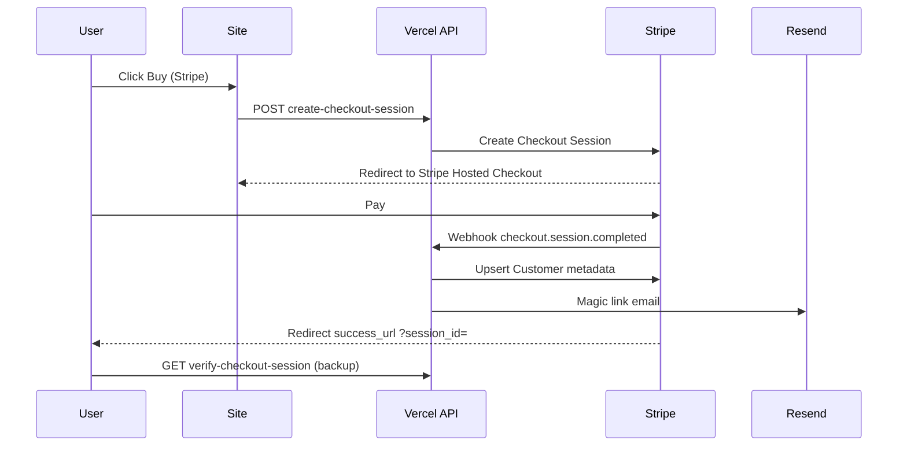
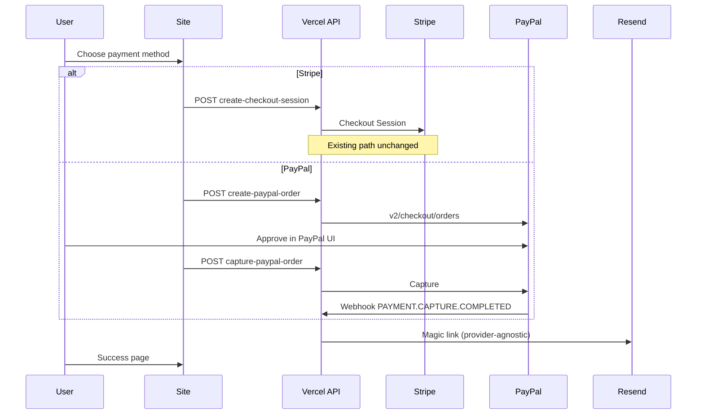

# Architecture — Stripe vs PayPal

How PayPal should plug into the existing becertifiedtoday checkout stack without duplicating business logic.

[[README|← PayPal hub]] · Checklist: [[Setup checklist]]

---

## Today (Stripe)

**Key files:**
- `api/create-checkout-session.js` — session creation
- `api/stripe-webhook.js` — async fulfillment
- `api/verify-checkout-session.js` — success page + magic-link backup
- `server-lib/portal-checkout-fulfillment.js` — shared grant + email logic

---

## Target (Stripe **or** PayPal chooser)

---

## What stays shared

| Concern | Shared? | Notes |
|---------|---------|-------|
| `productId` enum | Yes | Same strings as Stripe metadata |
| Access expiry math | Yes | `portalAccessExpiresAtMs` in `server-lib/ccna-portal-stripe.js` |
| Magic link JWT + email | Yes | Resend templates in `server-lib/ccna-portal-resend.js` |
| `PUBLIC_SITE_URL` | Yes | Redirect base |
| Customer record store | **Refactor** | Today metadata lives on **Stripe Customer**; PayPal buyers may never exist in Stripe |

---

## Refactor to plan (build phase)

Extract a provider-neutral function, e.g. `fulfillPortalPurchase({ productId, email, paidAt, provider, providerRef })`, called from:

1. `stripe-webhook.js` (existing)
2. `verify-checkout-session.js` (existing)
3. `paypal-webhook.js` (new)
4. `capture-paypal-order.js` (new)

Store PayPal purchases either:

- **Option A:** Stripe Customer with metadata `paypal_payer_id` / `last_paypal_order_id` (keeps one admin view in Stripe-heavy tooling), or
- **Option B:** Separate lightweight store (KV / DB) keyed by email + `providerRef` — cleaner long-term if Stripe is not required for PayPal users

- [ ] Decision: Option A vs B — record here: ___________________

---

## Idempotency

Stripe uses `session.id`. PayPal should use **`capture_id`** (primary) or **`order_id`**.

Before granting access, check if that ID was already fulfilled (log table or metadata flag).

---

## Analytics

Extend existing `bccTrackBeginCheckout` pattern:

| Event | New dimension |
|-------|----------------|
| `begin_checkout` | `payment_provider`: `stripe` \| `paypal` |
| `purchase` | same |

Keeps wedge / Reddit / Google campaign reporting comparable across providers.

---

## Out of scope for v1

- PayPal Subscriptions (you sell one-time access, not recurring)
- PayPal inside Stripe Checkout
- Automatic Stripe ↔ PayPal refund sync
- PayPal promo codes mirroring every Stripe coupon
